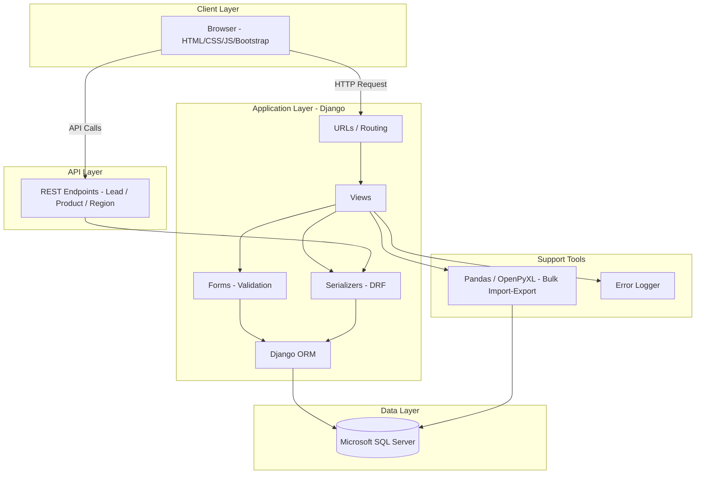
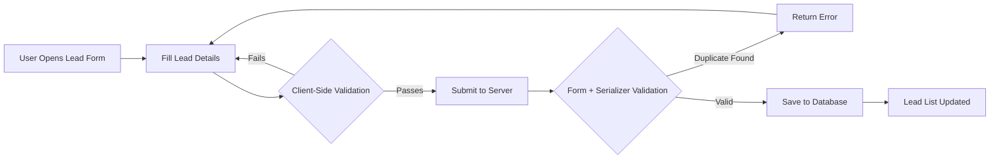
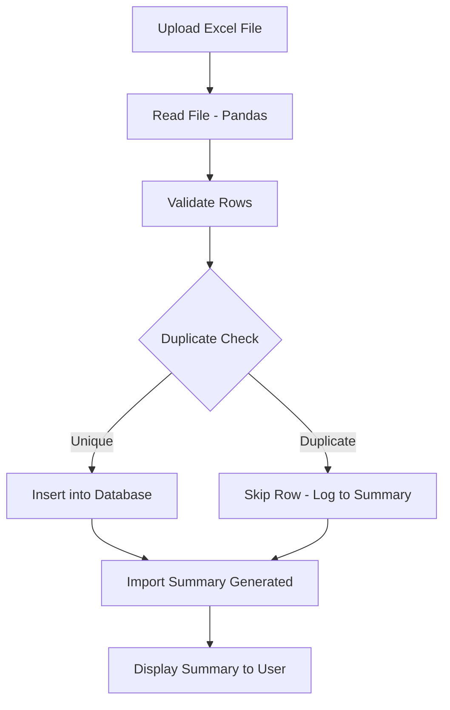

<div align="center">

# 🏢 Enterprise CRM System

### A Secure, Scalable Customer Relationship Management Platform Built with Django

*Developed during a Software Development Internship at Swast Solutions Private Limited*

[](https://www.python.org/)
[](https://www.djangoproject.com/)
[](https://www.django-rest-framework.org/)
[](https://www.microsoft.com/en-us/sql-server)
[](https://getbootstrap.com/)

[](#license)
[](https://github.com/Lakshya312)
[](https://github.com/Lakshya312)
[](https://github.com/Lakshya312)

</div>

---

## 📖 Table of Contents

- [Project Overview](#-project-overview)
- [Key Features](#-key-features)
- [Project Architecture](#-project-architecture)
- [Folder Structure](#-folder-structure)
- [Database Design](#-database-design)
- [Modules](#-modules)
  - [Authentication](#authentication)
  - [Dashboard](#dashboard)
  - [Lead Module](#lead-module)
  - [Product Module](#product-module)
  - [Region Module](#region-module)
- [REST API Documentation](#-rest-api-documentation)
- [Bulk Import Workflow](#-bulk-import-workflow)
- [Validation Rules](#-validation-rules)
- [Error Handling](#-error-handling)
- [Installation](#-installation)
- [Technologies Used](#-technologies-used)
- [Future Enhancements](#-future-enhancements)
- [Documentation](#-documentation)
- [Contributing](#-contributing)
- [License](#-license)
- [Contact](#-contact)

---

## 🧭 Project Overview

### Problem Statement

Organizations that rely on spreadsheets or fragmented tools to track leads, products, and regional data face inconsistent records, duplicate entries, and no centralized way to validate or search information. This leads to lost sales opportunities and unreliable reporting.

### Objectives

- Provide a single, structured system to manage **Leads**, **Products**, and **Regions**.
- Enforce data integrity through form-level and serializer-level validation.
- Expose REST APIs so the CRM can integrate with other internal tools.
- Support bulk import/export for fast onboarding of existing data.
- Maintain a clean audit trail through centralized error logging.

### Why This Project Exists

This CRM was built to solve a real operational need during an internship at Swast Solutions Private Limited — replacing manual, error-prone lead tracking with a database-backed, validated, and query-optimized web application.

### Who Can Use It

- Sales and business development teams tracking leads across regions.
- Organizations needing a lightweight, self-hosted CRM without third-party licensing costs.
- Developers looking for a reference Django + MSSQL + DRF implementation.

### Benefits

| Benefit | Description |
|---|---|
| 🎯 Centralized Data | Leads, Products, and Regions live in one validated system |
| 🔐 Data Integrity | Duplicate and regex validation at form and serializer level |
| ⚡ Fast Onboarding | Bulk import/export via Excel using Pandas & OpenPyXL |
| 🔌 API-First | Every module exposes REST endpoints for integration |
| 🧾 Traceability | Centralized error logging for debugging and audits |

---

## ✨ Key Features

| Module | CRUD | Search | Validation | Bulk Import/Export | REST API |
|---|:---:|:---:|:---:|:---:|:---:|
| **Lead** | ✅ | ✅ | ✅ | ✅ | ✅ |
| **Product** | ✅ | ✅ | ✅ | ✅ | ✅ |
| **Region** | ✅ | ✅ | ✅ | ✅ | ✅ |

**Other System-Level Features**

- 🔑 Authentication — Login, Logout, Session Management
- 📊 Dashboard overview
- 🧮 Django ORM with query optimization (`select_related` / `prefetch_related`)
- 📝 Centralized error logging (`error_log.txt`)
- 📥 Import summary reports after bulk operations
- 🚫 Duplicate validation across Lead, Product, and Region
- ✅ Required field validation on every form
- 📱 Responsive UI built with Bootstrap

---

## 🏗 Project Architecture



---

## 📁 Folder Structure

```
Lead_Management/
│
├── config/                        # Project-level settings, URLs, WSGI/ASGI entry points
│
├── crm/                            # Core application
│   ├── models.py                   # Lead, Product, Region models (DB-generated, managed=False)
│   ├── forms.py                    # Django Forms with widget-level + clean_ validation
│   ├── serializers.py              # DRF serializers for API-level validation
│   ├── views.py                    # CRUD views + API views
│   ├── urls.py                     # App-level URL routing
│
├── Documentation/
│   ├── User Guide.pdf              # End-user usage guide
│   ├── Developer Guide.pdf         # Setup & architecture notes for developers
│
├── diagrams/
│   └── er_diagram.png              # Entity-Relationship diagram
│
├── queries/                        # Raw SQL / optimization reference queries
│
├── requirements.txt                # Python dependencies
├── manage.py                       # Django management entry point
├── error_log.txt                   # Centralized runtime error log
├── LeadManagementDbScript.sql      # Full database schema script
├── Product_Lead_Data_Demo.xlsx     # Sample bulk import data
├── README.md
├── LICENSE
└── .gitignore
```

**Folder Notes**

- **`config/`** — Holds Django project settings, root URL configuration, and deployment entry points (WSGI/ASGI).
- **`crm/`** — The main Django app containing all business logic: models, forms, serializers, views, and URLs for Lead, Product, and Region modules.
- **`Documentation/`** — Reference guides for both end users and developers extending the system.
- **`diagrams/`** — Visual database design references.
- **`queries/`** — Stored/optimized SQL queries used for reporting and analysis outside the ORM.
- **`LeadManagementDbScript.sql`** — The complete MSSQL schema used to generate the unmanaged Django models.

---

## 🗄 Database Design

The system is backed by **Microsoft SQL Server**, with core Django models mapped as **unmanaged (`managed = False`)** since the schema is database-generated via `LeadManagementDbScript.sql`. Because of this, most business validation is enforced at the **Form** and **Serializer** level rather than the model level, since many database columns allow `NULL` for legacy compatibility.

**Core Entities**

- **Lead** — Central entity capturing prospect details (person name, contact info, business need) and foreign keys to Territory, Region, Product, Status, Lead Source, and Executive.
- **Product** — Catalog of products/services the organization offers, referenced by Leads.
- **Region** — Geographic/organizational region used to segment Leads and Territories.
- **Territory** — Sub-division within a Region for finer-grained lead assignment.


The diagram above represents the relationships between Lead, Product, Region, Territory, and supporting lookup tables (Status, Lead Source), all connected through foreign key constraints enforced at the database level.

---

## 🧩 Modules

### Authentication

**Purpose:** Restrict CRM access to authorized users only.

**Features**
- Login with session-based authentication
- Logout with session invalidation
- Session timeout handling

---

### Dashboard

**Purpose:** Provide a landing overview after login.

**Features**
- Quick navigation to Lead, Product, and Region modules
- Summary-level visibility into system activity

---

### Lead Module

**Purpose:** Capture and manage sales leads end-to-end.

**Features**
- Create, Read, Update, Delete leads
- Search by Lead ID, Lead Name, Product, and Region
- Duplicate validation on Person Name, Contact Number, and Email
- Required field enforcement across all mandatory attributes

**Workflow**



**Validation**
- `personname` — required, alphanumeric + spaces, duplicate check
- `contactno` — required, exactly 10 digits, duplicate check
- `email` — required, valid email format, duplicate check
- `city`, `state` — required, letters and spaces only
- `companyname` — required, regex-validated
- All foreign key fields (Territory, Region, Product, Status, Lead Source, Executive) — required

**APIs:** Create, List, Update, Delete (see [REST API Documentation](#-rest-api-documentation))

---

### Product Module

**Purpose:** Maintain the catalog of products associated with leads.

**Features**
- Full CRUD operations
- Search functionality
- Bulk Import / Bulk Export via Excel
- Regex validation on Product Name

**Validation**
- `productname` — required, regex-validated, duplicate check
- `added_by`, `added_dts` — auto-populated on creation

**APIs:** Create, List, Update, Delete

---

### Region Module

**Purpose:** Manage geographic/organizational regions used across the CRM.

**Features**
- Full CRUD operations
- Search functionality
- Bulk Import / Bulk Export via Excel
- Form + serializer-level validation

**APIs:** Create, List, Update, Delete

---

## 🔌 REST API Documentation

Base URL: `/api/`

### Lead Endpoints

| Method | Endpoint | Description |
|---|---|---|
| `GET` | `/api/leads/` | List all leads |
| `POST` | `/api/leads/` | Create a new lead |
| `PUT` | `/api/leads/<id>/` | Update an existing lead |
| `DELETE` | `/api/leads/<id>/` | Delete a lead |

<details>
<summary><strong>Sample Request — Create Lead (POST)</strong></summary>

```json
{
  "personname": "Rahul Sharma",
  "gender": "Male",
  "companyname": "Sharma Textiles",
  "contactno": "9876543210",
  "email": "rahul.sharma@example.com",
  "city": "Meerut",
  "state": "Uttar Pradesh",
  "territoryid": 3,
  "regionid": 1,
  "productid": 2,
  "statusid": 1,
  "leadsourceid": 4,
  "businessneed": "Looking for bulk fabric supply",
  "lead_gen_date": "2026-07-01",
  "executiveid": 12
}
```
</details>

<details>
<summary><strong>Sample Response</strong></summary>

```json
{
  "id": 145,
  "personname": "Rahul Sharma",
  "companyname": "Sharma Textiles",
  "contactno": "9876543210",
  "email": "rahul.sharma@example.com",
  "status": "Created"
}
```
</details>

**Status Codes**

| Code | Meaning |
|---|---|
| `200 OK` | Request succeeded |
| `201 Created` | Resource created successfully |
| `400 Bad Request` | Validation failed (e.g. duplicate email) |
| `404 Not Found` | Resource does not exist |
| `500 Internal Server Error` | Unexpected server error |

### Product Endpoints

| Method | Endpoint | Description |
|---|---|---|
| `GET` | `/api/products/` | List all products |
| `POST` | `/api/products/` | Create a new product |
| `PUT` | `/api/products/<id>/` | Update a product |
| `DELETE` | `/api/products/<id>/` | Delete a product |

### Region Endpoints

| Method | Endpoint | Description |
|---|---|---|
| `GET` | `/api/regions/` | List all regions |
| `POST` | `/api/regions/` | Create a new region |
| `PUT` | `/api/regions/<id>/` | Update a region |
| `DELETE` | `/api/regions/<id>/` | Delete a region |

> **Note:** All endpoints were tested and verified using **Postman** during development.

---

## 📦 Bulk Import Workflow

Bulk Import for Product and Region modules follows a validated pipeline using **Pandas** and **OpenPyXL**:



Each import produces a summary showing rows successfully inserted, rows skipped due to duplication, and any rows that failed validation.

---

## ✅ Validation Rules

| Rule Type | Applied To | Example |
|---|---|---|
| **Required Fields** | All mandatory model fields | `personname`, `email`, `contactno` |
| **Regex Validation** | Name/text fields | Letters only, letters + spaces, letters + numbers + spaces |
| **Phone Validation** | `contactno` | Exactly 10 digits |
| **Email Validation** | `email` | Valid email format |
| **Duplicate Validation** | `personname`, `contactno`, `email`, product/region names | Checked via `clean_<field>()` methods, excluding the current record on update |
| **Business Rules** | Lead status/source flow | Enforced through form and serializer clean methods |

Validation is layered in two places:
1. **Django Forms** — widget-level `pattern`/`required` attributes for instant browser feedback, plus `clean_<field>()` methods for duplicate checks.
2. **DRF Serializers** — mirrored validation to keep the REST API equally strict, independent of the HTML form layer.

---

## 🛠 Error Handling

- All unhandled exceptions across views are wrapped in `try/except` blocks.
- Errors are written to a centralized log file (`error_log.txt`) with timestamps for traceability.
- Bulk import failures are captured per-row rather than aborting the entire import.
- API errors return structured JSON with appropriate HTTP status codes instead of raw stack traces.

> 💡 **Tip:** During development, check `error_log.txt` first when debugging unexpected 500 errors — it captures the full traceback with a timestamp.

---

## ⚙️ Installation

```bash
# 1. Clone the repository
git clone https://github.com/Lakshya312/Enterprise-CRM-System.git
cd Enterprise-CRM-System

# 2. Create and activate a virtual environment
python -m venv venv
venv\Scripts\activate      # Windows
source venv/bin/activate   # macOS/Linux

# 3. Install dependencies
pip install -r requirements.txt

# 4. Configure the database
# Update config/settings.py with your MSSQL connection details
# (ODBC driver, server name, database name, credentials)

# 5. Run database migrations (for any managed models)
python manage.py migrate

# 6. Start the development server
python manage.py runserver
```

> ⚠️ **Warning:** The `Lead`, `Product`, and `Region` models are unmanaged (`managed = False`) and expect the schema from `LeadManagementDbScript.sql` to already exist in your MSSQL instance before starting the server.

---

## 🧰 Technologies Used

| Category | Technology |
|---|---|
| Backend Framework | Django |
| API Framework | Django REST Framework |
| Database | Microsoft SQL Server |
| Frontend | HTML, CSS, JavaScript, Bootstrap |
| Data Processing | Pandas, OpenPyXL |
| API Testing | Postman |
| Version Control | Git, GitHub |

---

## 🚀 Future Enhancements

- [ ] Pagination for large lead/product/region lists
- [ ] Role-Based Access Control (Admin, Executive, Viewer)
- [ ] Analytics dashboard with charts (lead conversion trends, regional performance)
- [ ] Dockerized deployment
- [ ] Cloud deployment (Azure, given MSSQL backend)
- [ ] Email/SMS notifications on lead status changes
- [ ] Audit logs for all create/update/delete actions

---

## 📚 Documentation

- [User Guide](Documentation/User%20Guide.pdf)
- [Developer Guide](Documentation/Developer%20Guide.pdf)

---

## 🤝 Contributing

Contributions are welcome. To contribute:

1. Fork the repository
2. Create a feature branch (`git checkout -b feature/your-feature`)
3. Commit your changes (`git commit -m "Add: your feature"`)
4. Push to your branch (`git push origin feature/your-feature`)
5. Open a Pull Request describing your changes

Please ensure any new form or serializer field includes matching validation on both the Django Form and DRF Serializer layers, consistent with the rest of the project.

---

## 📄 License

This project is licensed under the **MIT License** — see the [LICENSE](LICENSE) file for details.

---

## 📬 Contact

**Lakshya**

[](https://github.com/Lakshya312)

---

<div align="center">

*Built with Django during an internship at Swast Solutions Private Limited.*

</div>
